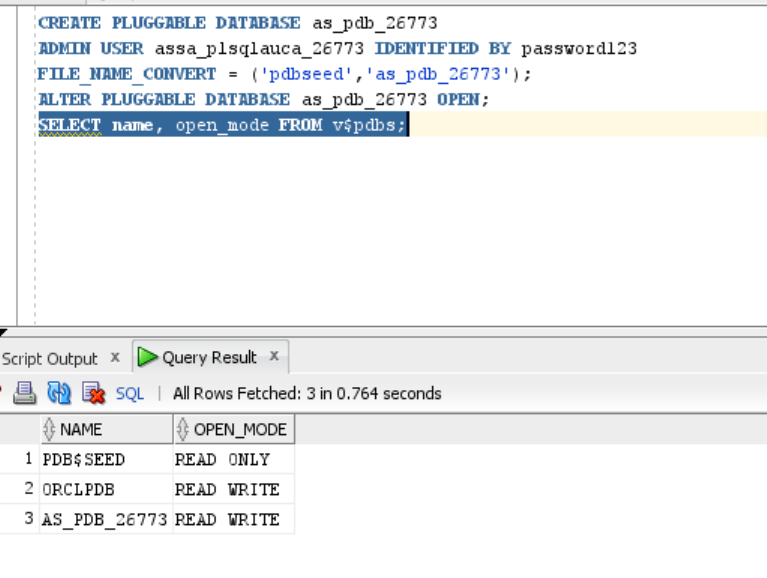
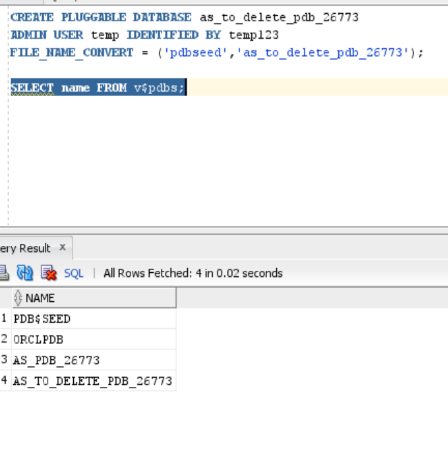
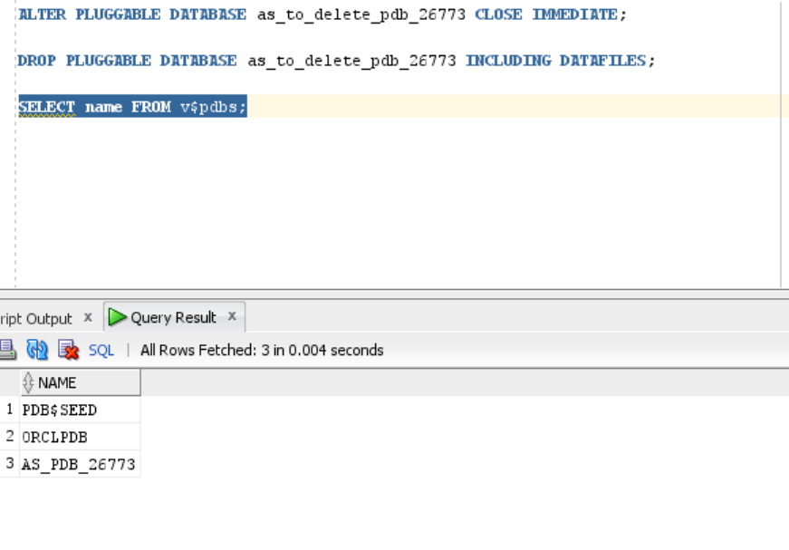
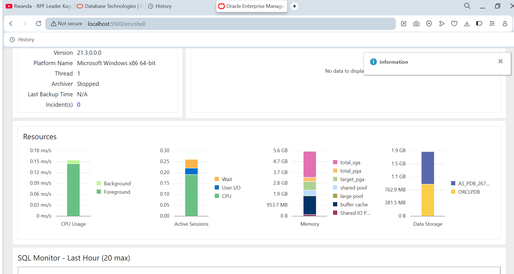

# Oracle Pluggable Database Assignment

## Overview of Tasks
This assignment covers the creation, management, and deletion of Oracle Pluggable Databases (PDBs) as part of hands-on exercises in Oracle Database administration. The tasks completed include:

1. Creating a new PDB and user.
2. Creating and deleting a temporary PDB.
3. Accessing and verifying PDBs via Oracle Enterprise Manager (OEM).

---

## Oracle Environment Used
- **Oracle Database Version:** Oracle Database 21c / 19c (adjust based on your setup)
- **CDB Name:** (your container database name)
- **Tools Used:** SQL*Plus, SQL Developer, Oracle Enterprise Manager (OEM)
- **Operating System:**  Windows 11 Home

---

## Task 1: Create a New Pluggable Database (PDB)
**PDB Name:** `as_pdb_26773`  
**Username inside PDB:** `Assa_plsqlauca_26773`  
**Password:** `Pass1234`

**Steps Completed:**
1. Connected to the CDB as SYSDBA.
2. Created the PDB using `CREATE PLUGGABLE DATABASE`.
3. Opened the PDB using `ALTER PLUGGABLE DATABASE ... OPEN`.
4. Created a user inside the PDB and granted required privileges.
5. Verified the PDB status and user creation.

**Evidence:**  
- Screenshot: 

---

## Task 2: Create and Delete a Temporary PDB
**Temporary PDB Name:** `as_to_delete_pdb_26773`  

**Steps Completed:**
1. Created the temporary PDB.
2. Verified its existence.
3. Closed and dropped the PDB completely including datafiles.
4. Confirmed deletion.

**Evidence:**
creating a temporary PDB  
- Screenshot: 
after deleted

---

## Task 3: Oracle Enterprise Manager (OEM)
**Steps Completed:**
1. Accessed OEM dashboard via web browser.
2. Verified the new PDB `as_pdb_26773` is open and operational.
3. Confirmed that the user `Assa_plsqlauca_26773` exists in the PDB.
4. Screenshot of dashboard taken.

**Evidence:**  
- Screenshot:

---

## Challenges Faced
- Initially, some file path issues during PDB creation were resolved by adjusting the `FILE_NAME_CONVERT` paths.
- Ensuring correct container connection to create users inside the PDB required setting `ALTER SESSION SET CONTAINER=...`.

---

## Integrity Statement
I hereby declare that this assignment is my own work. All steps, commands, and configurations were performed by me, and any references consulted were properly used to guide the completion of tasks.

**Name:** Assa Ndatimana  
**Student ID:** 26773  
**Date:** 2026-02-15
